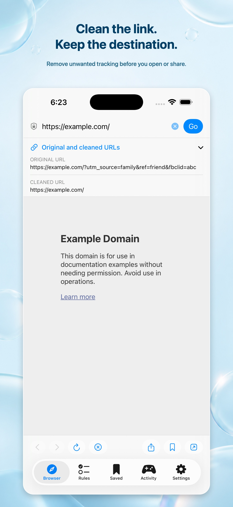
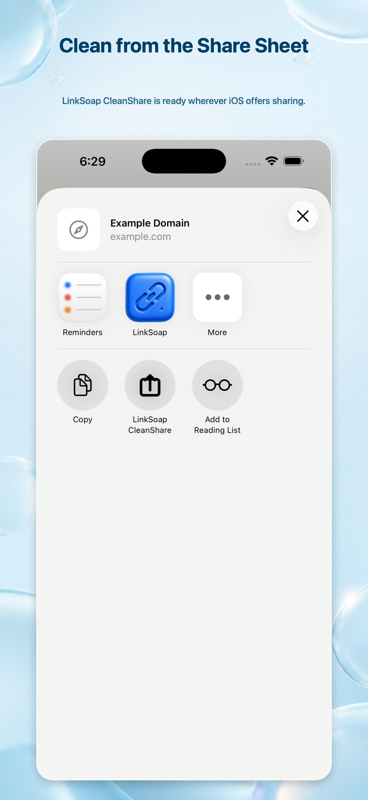
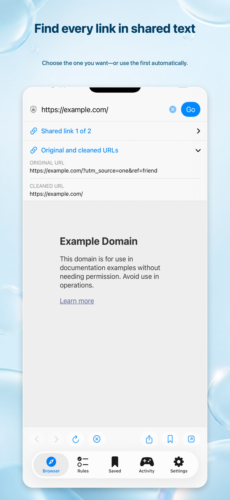
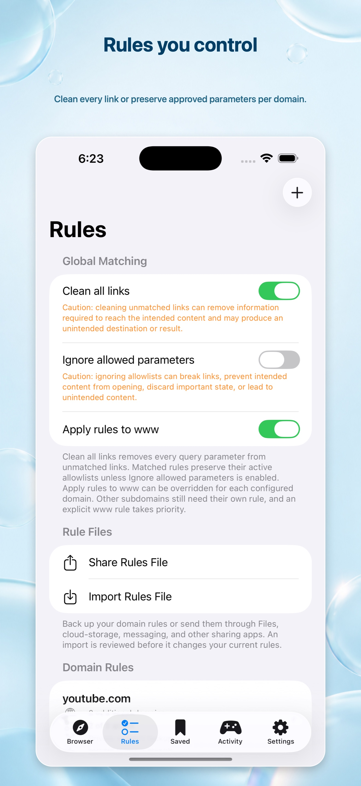
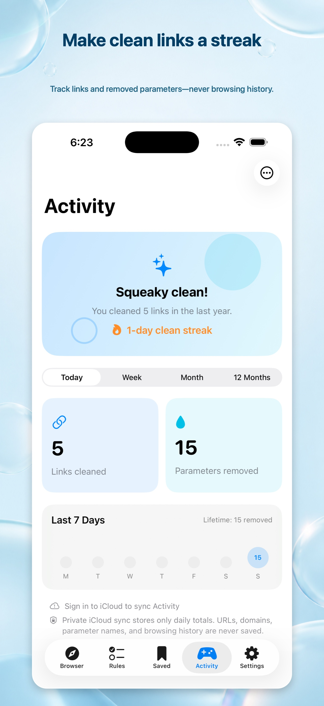
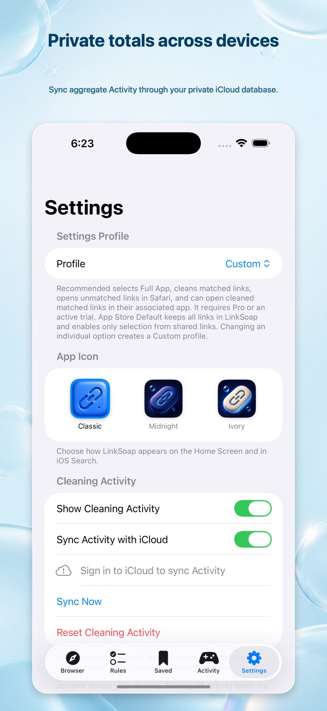

# 🧼 LinkSoap

**Share the destination—not the tracking.**

LinkSoap removes unwanted query parameters from web links before you share or open them, while preserving the destination you chose. Use it from the Share Sheet, copied text, Shortcuts, Control Center, or as your iPhone or iPad default browser.

[View LinkSoap on the App Store](https://apps.apple.com/app/id6801626756) · [Get support](https://lumalilt.com/products/LinkSoap/support) · [Read the privacy policy](https://lumalilt.com/products/LinkSoap/privacy)

  
  
  

## What LinkSoap does ✨

A shared link can contain tracking identifiers, campaign tags, referral data, and other parameters that are unrelated to the page you meant to send. LinkSoap applies rules you control, removes what you did not choose to keep, and gives you a cleaner URL to share, save, preview, or open.

LinkSoap can:

- remove tracking and unwanted query parameters;
- preserve parameters that a site genuinely needs with per-domain allowlists;
- follow shortened-link redirects before cleaning;
- resolve a site's published canonical page URL when supported;
- show the original, redirected or canonical, and final cleaned URLs;
- extract links from messages, clipboard contents, and other mixed text;
- let you choose when shared text contains multiple genuine links;
- save cleaned links for later; and
- open the result in LinkSoap, another browser, or a compatible installed app.

## Clean links wherever you find them

### From the Share Sheet

Use **LinkSoap CleanShare** to clean a link and immediately open a new system Share Sheet containing the result.

Use **LinkSoap Preview** when you want to compare the original and cleaned addresses, view the destination in a lightweight nonpersistent browser, or choose whether to copy, save, share, continue in LinkSoap, or open the result elsewhere.

If a message contains several links, LinkSoap can present the distinct URLs in their original order and process only the one you choose.

### From Messages or copied text

When another app does not offer a useful link-sharing action, copy its text and return to LinkSoap. The Browser view can detect that the clipboard offers web links without reading the clipboard first. LinkSoap reads the content only after you tap its Paste control, then extracts the links for cleaning or unchanged preview.

Optional Apple Shortcuts make copied-link workflows even faster:

- [CleanOpen](https://www.icloud.com/shortcuts/17415b8e3fe24fe6974b5e9c2e7faec2) cleans a link received from the Share Sheet and opens the result.
- [CleanClipboardShare](https://www.icloud.com/shortcuts/220d1ca2def74e7ea16c87872d5e07df) cleans copied links and prepares the result for sharing.
- [CleanClipboardOpen](https://www.icloud.com/shortcuts/7dd4d3e6001743c7b9ecaf1e8c1dd4fd) cleans a copied link and opens the one cleaned destination.

After installation, a clipboard Shortcut can be assigned to Apple's Shortcut control in Control Center, the Lock Screen, or the Action button. Apple always keeps Shortcut installation and these system controls under your control.

### As your default browser 🧭

Set LinkSoap as the iOS or iPadOS default browser to apply your rules when you tap links in Messages, Mail, social apps, and elsewhere.

With **Recommended Settings**, LinkSoap cleans matched links before preview, lets you choose among multiple shared links, can open cleaned matched links in their associated apps, and sends unmatched links unchanged to Safari. You may instead choose Chrome, Firefox, Brave, Edge, or LinkSoap for unmatched links in Settings.

**App Store Default** keeps incoming navigation in LinkSoap without automatically cleaning it. This is a useful starting point if you want to decide which cleaning and routing behavior to enable yourself. Changing an individual option creates a **Custom** profile.

To choose your default browser, open:

**iOS Settings → Apps → Default Apps → Browser App → LinkSoap**

## Rules you control

LinkSoap includes a starter catalog of useful domain rules. Related domains—such as `youtube.com` and `youtu.be`—can share one rule group and one allowlist.

You can enable or disable:

- a complete rule group;
- each domain in the group;
- each allowed query parameter;
- private redirect or canonical resolution for a rule; and
- conventional `www` matching globally or for an individual domain.

You can also choose to clean every link, including links that do not match a rule. Use that broader option carefully: some query parameters select specific content, preserve state, or control access, so removing everything can change or break the intended destination.

Rules can be exported free of charge as portable `.linksoaprules` files for backup or sharing. LinkSoap reviews an imported file and summarizes its changes before anything is applied. Applying imports requires LinkSoap Pro.

  
  
  

## Private link previews 🔒

The built-in browser uses nonpersistent website storage. Private redirect and canonical resolution use an ephemeral background session without LinkSoap browser cookies, saved credentials, or a persistent cache.

These features still contact the destination website. Like any website request, the site and network providers can receive ordinary connection information such as your IP address and the requested URL. LinkSoap does not operate a link-cleaning server that receives your links or browsing history.

Rules, preferences, saved links, and entitlement state are shared locally between LinkSoap and its extensions through Apple's App Group system. LinkSoap's Share extensions contain no advertising SDK.

For the complete explanation of local processing, iCloud, advertising, diagnostics, and third-party services, read the [LinkSoap Privacy Policy](https://lumalilt.com/products/LinkSoap/privacy).

## Cleaning Activity 🎮

The optional Activity view turns clean links into a small streak:

- totals for today, this week, this month, and the trailing 12 months;
- links actually changed by parameter removal;
- the number of parameters removed;
- a seven-day activity display, current streak, and lifetime totals; and
- optional private iCloud sync across your devices.

Activity stores only dates and aggregate counts. It never stores or syncs URLs, domains, parameter names, parameter values, clipboard contents, or browsing history. You can hide Activity, pause counting, disable sync, sync manually, or reset the totals from Settings.

## Saved links

Save a cleaned link from LinkSoap's browser or Share Preview and find it later in the **Saved** tab. From there, you can reopen or share it and delete individual entries or the complete list. LinkSoap keeps the 100 most recent distinct saved URLs on your device.

## Ads, trial, and upgrades

The full app may display an adaptive banner ad. Advertising is kept out of Share extensions.

- **Ad-Free** permanently removes ads.
- **LinkSoap Pro** removes ads and unlocks Quick Actions, Share Preview, automatic workflows, and Rules Import.
- The optional **21-day trial** unlocks all current features without automatically renewing or charging you.
- Permanent purchases remain available while a trial is active, and purchases can be restored through the App Store.

Google's regional consent and privacy controls are available in LinkSoap Settings when required. To flag advertising that is inappropriate or unsuitable for the app's age rating, use [Report an Ad](https://lumalilt.com/products/LinkSoap/report-ad). Reports filed through GitHub are public, so do not include personal or sensitive information.

## Getting started

1. Open LinkSoap and review the short first-run introduction.
2. Choose **Recommended Settings** for the simplest automated workflow, or **App Store Default** for direct browser behavior.
3. If desired, make LinkSoap your default browser in iOS Settings.
4. Open **Rules** to review the starter catalog and decide what each site should preserve.
5. Add LinkSoap CleanShare and LinkSoap Preview to your preferred Share Sheet positions.
6. Install any optional Shortcuts you want from LinkSoap Settings.
7. Paste, share, or open a link and review what LinkSoap cleaned.

## Compatibility

LinkSoap supports iPhone and iPad running iOS or iPadOS 18 or later, with adaptive layouts for both. It can also run on Apple Vision Pro using Apple's Designed for iPhone/iPad compatibility environment.

Opening associated apps and routing to other browsers depends on which compatible apps are installed. Websites can also change their redirect, canonical-link, or rendering behavior over time.

## Help and feedback 💬

- Visit [LinkSoap Support](https://lumalilt.com/products/LinkSoap/support) for help and issue-reporting guidance.
- [Report a reproducible bug](https://github.com/lumalilt/LinkSoap/issues/new?template=bug_report.yml).
- [Request a feature](https://github.com/lumalilt/LinkSoap/issues/new?template=feature_request.yml).
- [Report an inappropriate ad](https://lumalilt.com/products/LinkSoap/report-ad).
- Follow the private instructions in the [Security Policy](SECURITY.md) for a suspected vulnerability.

GitHub issues and their attachments are public. Do not include personal information, private URLs, credentials, or confidential screenshots in a public report.
